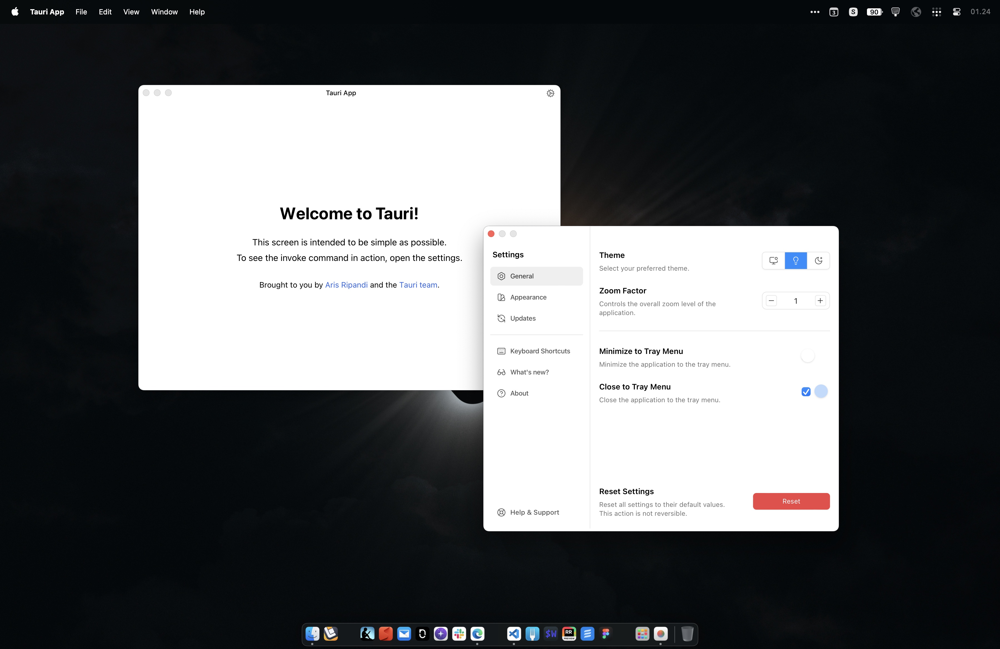
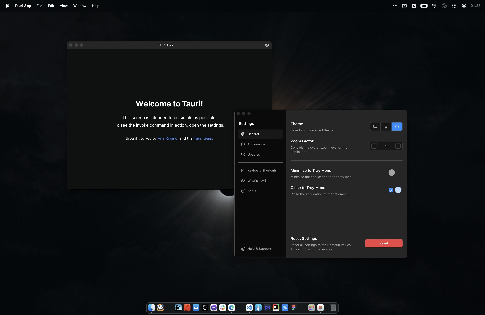

# ⚡️ Tauri Start Solid

[](https://github.com/riipandi/tauri-start-solid/pulse)
[](https://www.rust-lang.org)
[](https://tauri.app)

<!-- [](https://github.com/riipandi/tauri-start-solid/actions/workflows/test.yml) -->

---

This project template should help get you started developing a multi-platform desktop application
with tray menu support using Tauri, SolidJS, Nano Stores, Typescript, Tailwind CSS, and Vite.

## Quick Start

```sh
pnpm dlx tiged riipandi/tauri-start-solid my-app
```

1. Install required toolchains: [Rust][rust], [Node.js][nodejs], [PNPM][pnpm], and [Lefthook][lefthook].
2. Replace the project name in the [`package.json`](./package.json), [`Cargo.toml`](./src-tauri/Cargo.toml),
   and [`tauri.conf.json`](./src-tauri/tauri.conf.json) files.
3. Find and replace `tauri-start-solid`, `tauri_start_solid` and `Tauri App` strings in the source files.
4. Set application identifier and other application metadata in [`tauri.conf.json`](./src-tauri/tauri.conf.json) file.
5. Install frontend dependencies by running `pnpm install`.
6. Run `pnpm dev` to start developing.

To build the application, run `pnpm build`. You can also run `pnpm build:debug`
to build the application in debug mode, this will enable developer tools.

## What's Inside?

- [x] Tauri v2 + essential plugins:
    - [x] `tauri-plugin-dialog`
    - [x] `tauri-plugin-http`
    - [x] `tauri-plugin-log`
    - [x] `tauri-plugin-notification`
    - [x] `tauri-plugin-os`
    - [x] `tauri-plugin-positioner`
    - [x] `tauri-plugin-process`
    - [x] `tauri-plugin-shell`
- [x] Custom titlebar (desktop)
- [x] Custom application menu
- [x] Application updater
- [x] Read values from `.env` file
- [x] Auto-generated Typescript types
- [x] Theme switcher (dark & light mode)
- [x] Application settings with separated window
- [x] Global state with [`persy`][persy] key-value database as backend
- [x] Frontend app with [SolidJS][solidjs] + [Tailwind CSS][tailwindcss]
- [x] Frontend lint & format using [Biome][biome]
- [x] Git hooks tasks with [Lefthook][lefthook]
- [x] GitHub actions for CI testing and build

## Recommended IDE Setup

[Visual Studio Code](https://code.visualstudio.com/) + [Recomended extensions](./.vscode/extensions.json)

### Fix Unsigned Warning (macOS)

> Warning: "Tauri App" is damaged and can't be opened.

This warning is shown because the build is not signed. Run the following command
 to suppress this warning:

```sh
xattr -r -d com.apple.quarantine "/Applications/Tauri App.app"
```

## Screenshots




## Acknowledgements

- [Tauri Examples Repo](https://github.com/tauri-apps/tauri/tree/dev/examples)
- [tauri-start-solid-example](https://github.com/dheater/tauri-start-solid-example)
- [tauri-tray-icon-animation](https://github.com/rming/tauri-tray-icon-animation)
- [tauri-tray-menu](https://github.com/rming/tauri-tray-menu)
- [tauri-window-controls](https://github.com/agmmnn/tauri-controls)
- [tauri-plugin-theme](https://github.com/wyhaya/tauri-plugin-theme)
- [hamza72x/web2app](https://github.com/hamza72x/web2app)
- [Create a Menu Bar App With Tauri](https://betterprogramming.pub/create-menubar-app-with-tauri-510ab7f7c43d)
- [Publishing Tauri to Apple's App Store](https://thinkgo.io/post/2023/02/publish_tauri_to_apples_app_store)
- [GTK Installation Docs](https://www.gtk.org/docs/installations/macos)
- [Tips For Faster Rust Compile Times](https://corrode.dev/blog/tips-for-faster-rust-compile-times)
- [Tauri State Management](https://tauri.by.simon.hyll.nu/concepts/tauri/state_management)

## License

Licensed under either of [Apache License 2.0][license-apache] or [MIT license][license-mit] at your option.

> Unless you explicitly state otherwise, any contribution intentionally submitted
> for inclusion in this project by you, as defined in the Apache-2.0 license, shall
> be dual licensed as above, without any additional terms or conditions.

Copyrights in this project are retained by their contributors.

See the [LICENSE-APACHE](./LICENSE-APACHE) and [LICENSE-MIT](./LICENSE-MIT) files
for more information.

[rust]: https://www.rust-lang.org/tools/install
[solidjs]: https://www.solidjs.com
[biome]: https://biomejs.dev
[nodejs]: https://nodejs.org/en/download
[pnpm]: https://pnpm.io/installation
[tailwindcss]: https://tailwindcss.com
[persy]: https://crates.io/crates/persy
[lefthook]: https://github.com/evilmartians/lefthook
[riipandi-twitter]: https://twitter.com/intent/follow?screen_name=riipandi
[license-mit]: https://choosealicense.com/licenses/mit/
[license-apache]: https://choosealicense.com/licenses/apache-2.0/

---

<sub>🤫 Psst! If you like my work you can support me via [GitHub sponsors](https://github.com/sponsors/riipandi).</sub>

[][riipandi-twitter]
